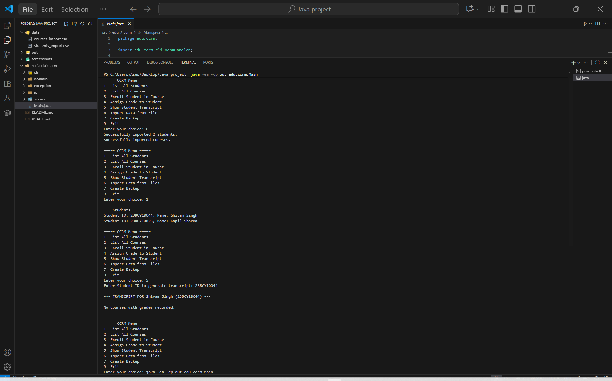
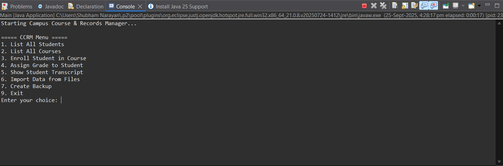
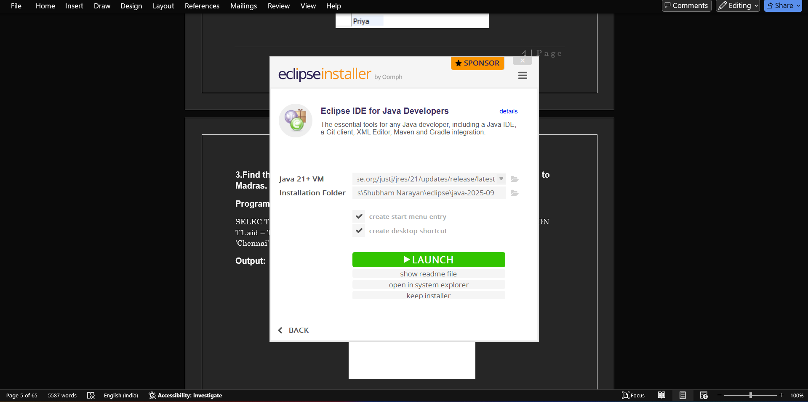
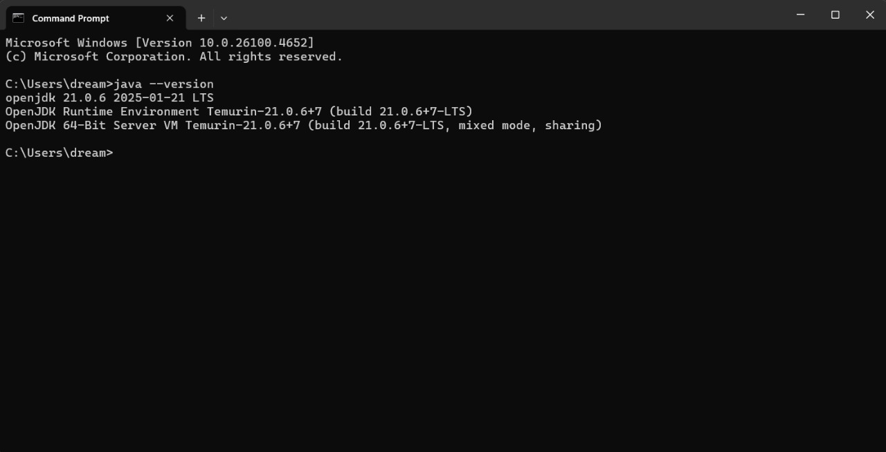
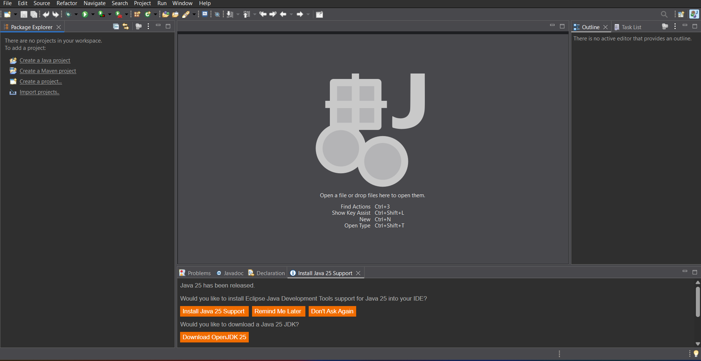
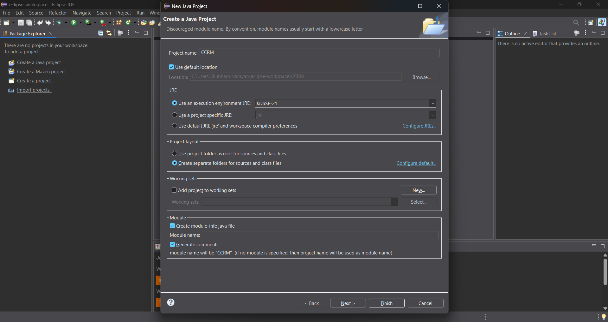
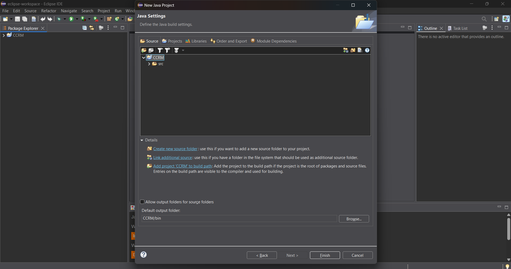
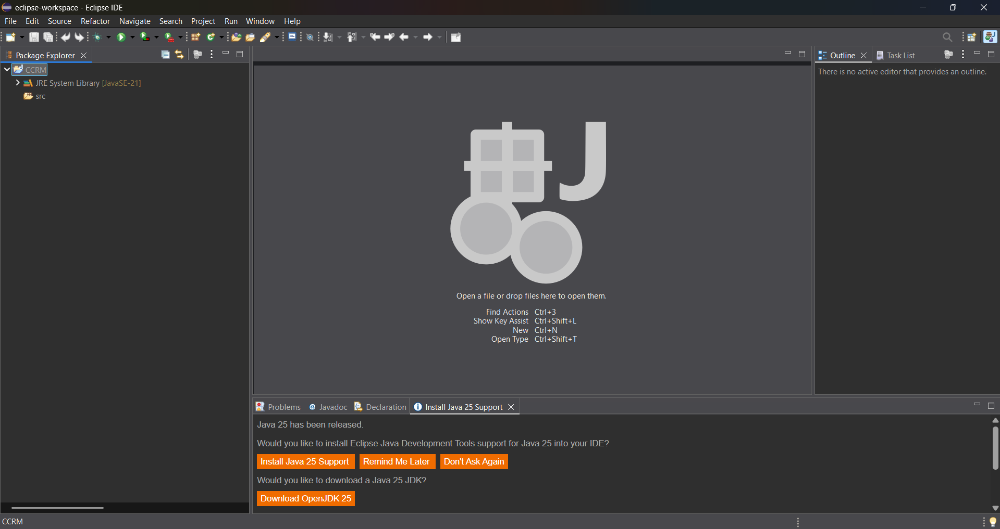
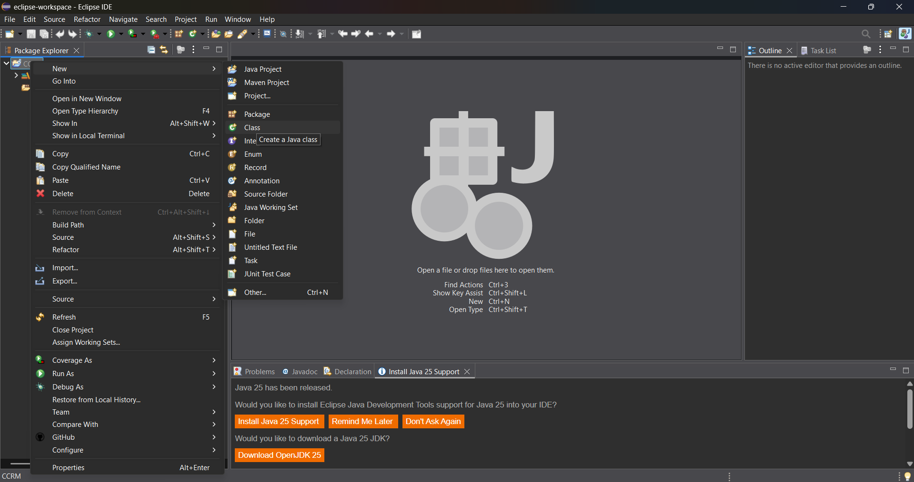
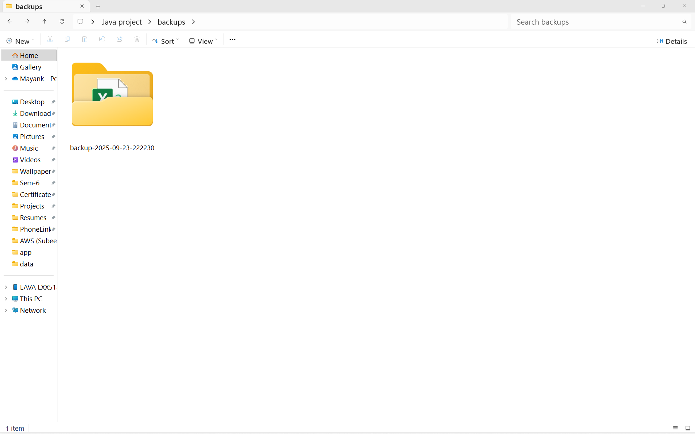

# 🎓 CCRM 

> **A comprehensive console application built from scratch to manage student and course records, demonstrating advanced Java SE features and modern programming practices.**

This project showcases a wide range of Java capabilities, from core Object-Oriented Programming principles to modern file I/O operations, all wrapped in an intuitive console interface.

---

## 🚀 Project Overview & How to Run

This application provides a complete student management system that allows users to:
- 📊 Import data from CSV files
- 👨‍🎓 Enroll students in courses
- 📝 Assign and manage grades
- 🎯 View comprehensive transcripts with calculated GPAs
- 💾 Create automated timestamped backups

### 📋 Prerequisites
- **Java Development Kit (JDK) 17 or newer** ☕

### 🔧 How to Run

#### Step 1: Compile
Open a terminal in the project's root folder and execute:
```bash
javac -d out -sourcepath src src/edu/ccrm/Main.java
```
*This creates an `out` folder with the compiled bytecode.*

#### Step 2: Run
After successful compilation, launch the application:
```bash
java -ea -cp out edu.ccrm.Main
```

<div align="center">





</div>

---

## 📈 Evolution of Java

### Key Milestones in Java's Journey

| Year | Version | Major Features |
|------|---------|----------------|
| **1995** | Java 1.0 | 🎉 Initial release - "Write Once, Run Anywhere" |
| **2004** | Java 5 | 🔧 Generics, Enums, Annotations |
| **2014** | Java 8 | ⚡ Lambda Expressions, Stream API |
| **2018-Present** | Modern Java | 🚀 6-month release cycle, LTS versions |

*The Stream API and Lambda Expressions from Java 8 are extensively used throughout this project!*

---

## 🏗️ Java Platform Comparison

### Understanding the Java Ecosystem

<table>
<tr>
<th>Platform</th>
<th>Target</th>
<th>Use Cases</th>
<th>Project Usage</th>
</tr>
<tr>
<td><strong>Java SE</strong><br/>(Standard Edition)</td>
<td>🖥️ Desktop & Server</td>
<td>General applications, console apps</td>
<td><strong>✅ Used in this project</strong></td>
</tr>
<tr>
<td><strong>Java EE</strong><br/>(Enterprise Edition)</td>
<td>🌐 Enterprise Web</td>
<td>Large-scale business applications</td>
<td>❌ Not applicable</td>
</tr>
<tr>
<td><strong>Java ME</strong><br/>(Micro Edition)</td>
<td>📱 Embedded/IoT</td>
<td>Resource-limited devices</td>
<td>❌ Not applicable</td>
</tr>
</table>

---

## 🔧 Java Architecture: JDK, JRE, and JVM

### Understanding the Java Stack

```
┌─────────────────────────────────────┐
│            JDK (Development)        │
│  ┌─────────────────────────────────┐│
│  │         JRE (Runtime)           ││
│  │  ┌─────────────────────────────┐││
│  │  │    JVM (Virtual Machine)    │││
│  │  │                             │││
│  │  └─────────────────────────────┘││
│  │  + Core Libraries               ││
│  └─────────────────────────────────┘│
│  + Compiler (javac) & Tools        │
└─────────────────────────────────────┘
```

- **🔧 JVM (Java Virtual Machine):** The execution engine that runs Java bytecode, enabling platform independence
- **🏃‍♂️ JRE (Java Runtime Environment):** Runtime platform including JVM + core libraries for *running* Java applications
- **👨‍💻 JDK (Java Development Kit):** Complete development platform including JRE + compiler (`javac`) + development tools

---

## 💻 Windows & Eclipse Setup Guide

### 🪟 Windows JDK Installation

#### Step-by-Step Installation Process

1. **Download** the JDK installer from Oracle or OpenJDK website
2. **Execute** the `.exe` installer and follow the setup wizard

   

3. **Configure Environment Variables:**
   - Set `JAVA_HOME` → `C:\Program Files\Java\jdk-21`
   - Update `Path` → Add `%JAVA_HOME%\bin`

4. **Verify Installation** in Command Prompt:
   ```cmd
   java -version
   javac -version
   ```

   

### 🌙 Eclipse Project Setup

#### Creating Your Development Environment

1. **Start New Project:** `File > New > Java Project`

   

2. **Configure Project Settings:**
   - Project name: `CCRM-Project`
   - Ensure correct JRE version

   

3. **Finalize Creation:** Click "Finish"

   

4. **Create Package Structure:** Right-click `src` folder
   - `edu.ccrm.domain`
   - `edu.ccrm.cli`
   - `edu.ccrm.service`

   

5. **Add Classes:** Right-click packages to create Java classes

   

---

## 🗺️ Syllabus Topics Implementation Map

### 📚 Comprehensive Feature Coverage

<details>
<summary><strong>🏗️ Object-Oriented Programming Concepts</strong></summary>

| Concept | Implementation | Location |
|---------|----------------|----------|
| **Inheritance & Abstraction** | `Student` extends abstract `Person` | `domain/Student.java` → `domain/Person.java` |
| **Polymorphism** | Abstract `getDetails()` method implementation | `Person` class hierarchy |
| **Encapsulation** | Private fields with public getters/setters | All domain classes |

</details>

<details>
<summary><strong>🎨 Design Patterns</strong></summary>

| Pattern | Purpose | Implementation |
|---------|---------|----------------|
| **Singleton** | Single configuration instance | `service/AppConfig.java` |
| **Builder** | Clean object creation | `domain/Course.java` (nested class) |

</details>

<details>
<summary><strong>🔧 Modern Java Features</strong></summary>

| Feature | Usage | Location |
|---------|-------|----------|
| **NIO.2 File I/O** | Modern file operations | `io/DataImporter.java`, `io/BackupUtil.java` |
| **Streams & Lambdas** | Data processing & searching | `CourseService.java`, `DataImporter.java` |
| **Enums with Fields** | Grade points calculation | `domain/Grade.java` |
| **Date/Time API** | Backup timestamps | `io/BackupUtil.java` |

</details>

<details>
<summary><strong>🔍 Advanced Programming Concepts</strong></summary>

| Concept | Implementation | Details |
|---------|----------------|---------|
| **Custom Exceptions** | Domain-specific error handling | `exception/StudentNotFoundException.java` |
| **Recursion** | Directory traversal | `calculateDirectorySize()` in `BackupUtil.java` |
| **Assertions** | Runtime validation | `Course.Builder` class validation |

</details>

---

## ⚡ Application Usage & Commands

### 🔧 Enabling Assertions
> **Important:** The `-ea` flag is **required** to enable assertion validation in the `Course.Builder` class.

### 📋 Sample Command Workflow

Follow this typical user journey through the application:

```
🚀 Application Startup
├── 6️⃣ Import Data from Files
├── 1️⃣ List All Students (verify import)
├── 2️⃣ List All Courses (verify import)
├── 3️⃣ Enroll Student in Course
│   ├── Student ID: S101
│   └── Course Code: MA201
├── 5️⃣ Show Student Transcript
└── 💾 Automatic Backup Creation
```

### 📁 Automated Backup System

The application automatically creates timestamped backups:



---

## 🎯 Key Features Summary

- ✅ **Complete OOP Implementation** with inheritance and polymorphism
- ✅ **Modern Java 8+ Features** including Streams and Lambda expressions  
- ✅ **Professional Design Patterns** (Singleton, Builder)
- ✅ **Robust File I/O** using NIO.2 APIs
- ✅ **Custom Exception Handling** for better error management
- ✅ **Automated Backup System** with timestamps
- ✅ **Comprehensive Data Management** for students and courses
- ✅ **GPA Calculation Engine** with grade point system

---

<div align="center">

**Built with ❤️ using Java SE | Demonstrating Modern Programming Practices**

</div>
